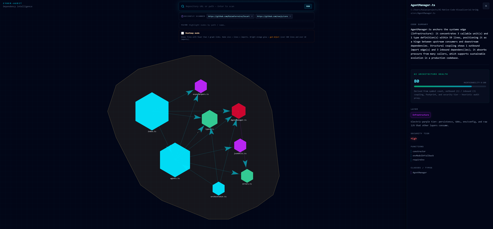

# AI-Native Code Visualizer

**Turn a repository into a live dependency graph you can explore.**  
Parse TypeScript, TSX, JavaScript, and C# with a Rust backend, scan remotes or local trees from the browser, and optionally enrich the graph with LLM-powered architecture hints.

---

## Why this exists

Large codebases hide coupling and “god objects” behind folder structure. This project:

- **Extracts** files, imports, symbols, and edges into a single JSON graph.
- **Visualizes** them in a force-directed dashboard with folder clusters, heatmap mode, and architectural violation highlights.
- **Scales** from a quick local scan to a shallow git clone via HTTPS or SSH.

The UI is built for audit-style workflows: search, zoom into folders, and spot high-risk modules at a glance.

### Screenshot



```markdown

```

Optional width control (GitHub renders this HTML):

```html

```

---

## What’s in the box

| Piece | Role |
|--------|------|
| **`backend/`** | Rust CLI + tree-sitter parsers. Writes `graph_output.json` or serves as the binary spawned by the scanner API. |
| **`scanner-api/`** | Small Node HTTP service: `POST /api/scan` runs the Rust binary and returns the graph JSON. |
| **`frontend/`** | Vue 3 + Vite + Tailwind + `force-graph` dashboard. Proxies `/api` to the scanner API. |
| **`ai-bridge/`** *(optional)* | TypeScript pipeline to enrich raw graphs with LLM metadata (layers, security notes). Feeds `enriched_graph.json` for the UI. |

---

## Prerequisites

- **Node.js** `^20.19.0` or `>=22.12.0`
- **Rust** toolchain (`cargo`, `rustc`) for `backend/`
- **Git** (for cloning remote repositories during scans)

---

## Install (use `npm ci`)

Use **`npm ci`** for reproducible installs from each package’s lockfile—ideal for CI and for matching the exact dependency tree the project was tested with.

From the repo root, install **each** Node project that ships a `package-lock.json`:

```bash
cd frontend && npm ci && cd ..
cd scanner-api && npm ci && cd ..
cd ai-bridge && npm ci && cd ..
```

> **`npm ci` vs `npm install`:** `npm ci` removes `node_modules` and installs strictly from the lockfile. Run it whenever you want a clean, deterministic install (especially in automation).

---

## Build the Rust analyzer

The scanner API shells out to the compiled `backend` binary (or falls back to `cargo run`). Build once:

```bash
cd backend
cargo build --release
```

For development you can use `cargo build` (debug binary under `target/debug/`).

---

## Run the stack (dashboard + live scans)

**Terminal 1 — scanner API** (default `http://127.0.0.1:8787`):

```bash
cd scanner-api
npm run dev
```

Override the port with `SCANNER_API_PORT` if needed.

**Terminal 2 — frontend**:

```bash
cd frontend
npm run dev
```

Open the URL Vite prints (usually `http://localhost:5173`). The dev server proxies **`/api`** to the scanner API (`SCANNER_API_URL` in Vite defaults to `http://127.0.0.1:8787`).

**In the UI**

- Paste a **git URL** (`https://…` or `git@…`) or a **local path** (same machine as the API) and run a scan.
- On first load, the app may also read **`/enriched_graph.json`** from the dev server’s `public/` folder if present.

---

## Run the Rust CLI only

Analyze the current directory or a path / URL without the web UI:

```bash
cd backend
cargo run --release -- [path-or-git-url]
```

Writes **`graph_output.json`** in the current working directory (the CLI’s `cwd` is typically `backend/` when run from there).

Optional HTTP mode (if enabled in your tree):

```bash
cargo run -- serve
```

---

## Optional: AI enrichment (`ai-bridge`)

Copy **`ai-bridge/.env-example`** to **`ai-bridge/.env`** and add API keys / model settings. Then:

```bash
cd ai-bridge
npm run dev
```

Produces enriched graph JSON you can place as **`frontend/public/enriched_graph.json`** or merge into your workflow.

---

## Environment cheat sheet

| Variable | Where | Purpose |
|----------|--------|---------|
| `SCANNER_API_PORT` | `scanner-api` | Listen port (default `8787`). |
| `SCANNER_API_URL` | `frontend` (Vite) | Proxy target for `/api` during `npm run dev`. |
| `RUST_SCANNER_BIN` | `scanner-api` | Absolute path to `backend` executable; skips `cargo run` fallback. |
| `CORS_ORIGIN` | `scanner-api` | Restrict CORS when calling the API from a non-proxied origin. |

---

## Scripts reference

| Package | Command | Meaning |
|---------|---------|---------|
| `frontend` | `npm run dev` | Vite dev server + dashboard. |
| `frontend` | `npm run build` | Production build (runs type-check). |
| `scanner-api` | `npm run dev` | API with file watcher (`tsx watch`). |
| `scanner-api` | `npm run start` | Run API once. |
| `ai-bridge` | `npm run dev` | Enrichment pipeline via `tsx`. |
| `ai-bridge` | `npm run build` | Compile to `dist/`. |

---

## License

See repository files for license terms if specified.
